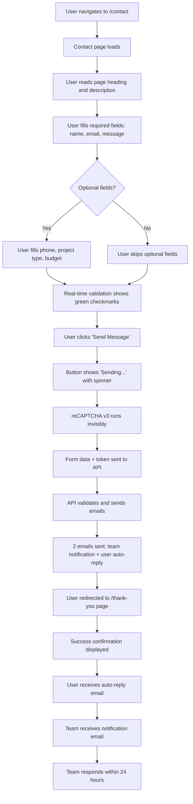

# User Flow: Contact Form Submission

**Flow Name:** Contact Form Submission
**Primary Actor:** Potential Client (Startup Founder / Small Business Owner)
**Trigger:** User wants to inquire about MountArc's services
**Goal:** Successfully submit contact inquiry and receive confirmation
**Related Epic:** [Epic 2 - Contact Form System](../epics/epic-2-contact-form/README.md)

---

## Happy Path Flow



---

## Detailed Step-by-Step Flow

### Step 1: Page Access
**User Action:** Clicks "Contact" in navigation or navigates to `/contact`
**System Response:** Loads contact page with form
**UI State:** Form visible, all fields empty, submit button enabled

### Step 2: Form Viewing
**User Action:** Views page content
**System Response:** Displays heading, description, form fields, alternative contact
**UI State:** Clean, professional layout

### Step 3: Required Fields Entry
**User Action:** Fills in name, email, and message
**System Response:** Real-time validation as user types
**UI State:**
- Valid fields: Green checkmark or green border
- Invalid fields: Red border + error message
- Character counter on message field (0/250)

### Step 4: Optional Fields (If Desired)
**User Action:** Selects phone, project type, and budget range
**System Response:** Validation applies if fields are filled
**UI State:** Dropdowns expand, phone validates format

### Step 5: Submit Attempt
**User Action:** Clicks "Send Message" button
**System Response:** Validates all fields
**UI State:**
- If valid: Button shows loading state
- If invalid: Errors displayed, submission prevented

### Step 6: Form Submission
**User Action:** (Button already clicked)
**System Response:**
- Disables button
- Shows spinner + "Sending..." text
- Executes reCAPTCHA v3
- Sends POST request to `/api/send-email`
**UI State:** Button disabled, loading indicator visible

### Step 7: API Processing
**System Action:** API receives request
**System Response:**
- Validates form data
- Verifies reCAPTCHA token
- Checks rate limiting
- Sends Email A (to team)
- Sends Email B (to user)
- Returns success response
**Duration:** 1-2 seconds

### Step 8: Success Redirect
**System Action:** API returns success
**System Response:** Redirects to `/thank-you` page
**UI State:** Thank you page loads

### Step 9: Confirmation Display
**User View:** Thank you page with:
- Success icon (green checkmark)
- "Thank You! We'll Be In Touch Soon"
- Confirmation message
- "What Happens Next" section
- Action buttons (services, work, blog)
**System State:** Form submission complete

### Step 10: Email Delivery
**System Action:** Resend delivers emails
**System Response:**
- Team receives notification at `contact@mountarc.com` (or testing email)
- User receives auto-reply at their email address
**Duration:** Within 30 seconds

### Step 11: Follow-up
**Team Action:** Reviews submission
**Team Response:** Reaches out within 24 hours via email or phone

---

## Alternative Flow: Validation Error

```
1. User fills form with invalid data (e.g., email without @)
2. Real-time validation shows error: "Please enter a valid email address"
3. User attempts to submit → Submission prevented
4. Error messages highlight invalid fields
5. User corrects errors
6. Validation passes → Green indicators shown
7. User submits successfully → Continue happy path
```

---

## Alternative Flow: API Error

```
1. User submits form with valid data
2. Button shows loading state
3. API request fails (network issue, server error)
4. Error message displayed: "Oops! Something went wrong..."
5. Submit button re-enabled
6. Form data preserved (not cleared)
7. Alternative contact shown: "Email us at contact@mountarc.com"
8. User can retry or email directly
```

---

## Alternative Flow: Rate Limit Hit

```
1. User submits contact form successfully
2. User immediately returns to /contact page
3. User fills out form again with same email
4. User clicks submit
5. Button shows loading
6. API checks rate limit → Same email submitted <5 minutes ago
7. API returns 429 error
8. Error message: "Please wait before submitting again"
9. User must wait 5 minutes to resubmit
```

---

## Alternative Flow: reCAPTCHA Failure

```
1. User fills form (possibly a bot)
2. User submits
3. reCAPTCHA v3 runs, returns low score (<0.5)
4. API verifies token → Score too low
5. API returns 403 error
6. Error message: "Security verification failed. Please try again."
7. User can retry (legitimate users usually pass on retry)
```

---

## Edge Cases

### Edge Case 1: User Navigates Away During Submission
**Scenario:** User closes tab while "Sending..." is showing
**Result:** API request may still complete, emails may still send
**Impact:** Team receives notification, user doesn't see confirmation

### Edge Case 2: Slow Network
**Scenario:** User on slow 3G connection
**Flow:** Submission takes 5-8 seconds instead of 1-2 seconds
**Result:** Loading spinner shows longer, then succeeds or times out after 10s

### Edge Case 3: Duplicate Submission
**Scenario:** User clicks submit button multiple times rapidly
**Result:** Button disabled on first click, subsequent clicks ignored
**Outcome:** Only one submission processed

---

## Success Criteria

**User Perspective:**
- ✅ Form is easy to find and fill out
- ✅ Validation helps correct errors before submission
- ✅ Clear confirmation that message was received
- ✅ Know what to expect next (24-hour response)

**Business Perspective:**
- ✅ Capture all necessary information
- ✅ Both team and user receive emails
- ✅ Spam is blocked by reCAPTCHA
- ✅ Professional user experience

---

## Metrics to Track

- **Form Views:** How many people visit /contact
- **Form Starts:** How many start filling out the form
- **Form Completions:** How many submit successfully
- **Validation Errors:** Which fields cause most errors
- **Spam Blocked:** How many reCAPTCHA failures
- **Response Time:** How long API takes to respond

---

## Related Documentation

- [Epic 2: Contact Form System](../epics/epic-2-contact-form/README.md)
- [US-004: Contact Form Page](../epics/epic-2-contact-form/US-004-contact-form-page.md)
- [US-007: Form Submission](../epics/epic-2-contact-form/US-007-form-submission.md)
- [PRD - Contact Form](../PRD.md#feature-2-contact-form-page)

---

**Created By:** Business Analyst
**Date:** 2026-01-22
**Version:** 1.0