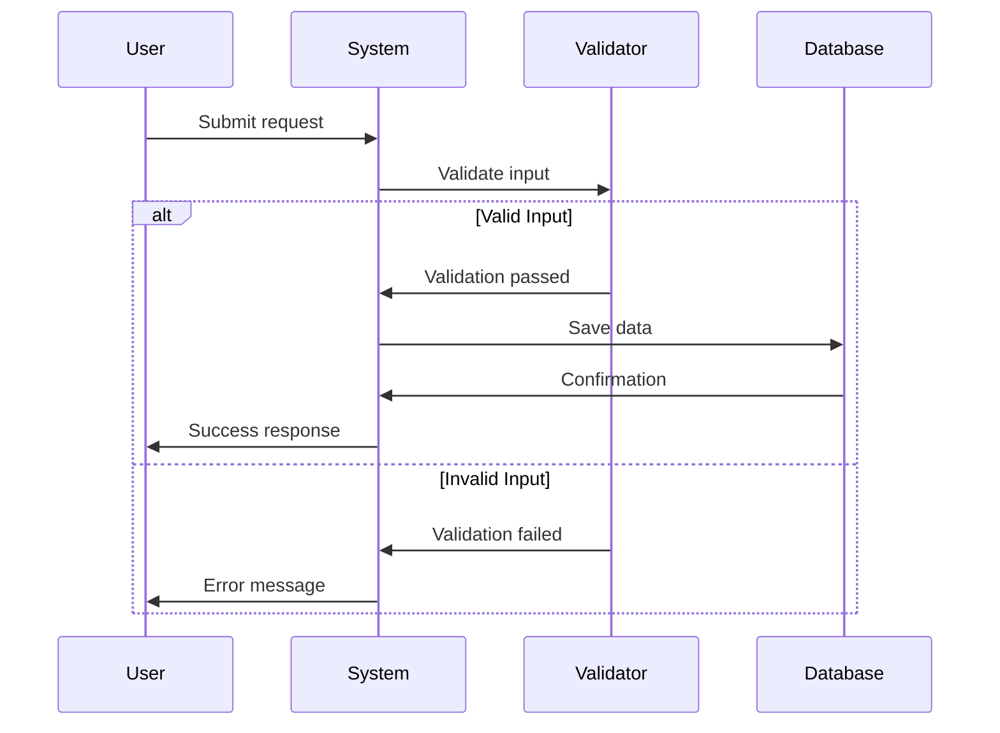

# Feature: [Feature Name]

**Epic**: [Epic Name]
**Priority**: Must Have / Should Have / Could Have
**Status**: Draft / Review / Approved / Implemented
**Created**: [YYYY-MM-DD]
**Last Updated**: [YYYY-MM-DD]
**Owner**: [BA Name or Role]

---

## 📋 Overview

[Brief description of the feature - 2-3 sentences explaining what this feature does and why it's needed]

---

## 👥 User Stories

- As a [role], I want [goal], so that [benefit]
- As a [role], I want [goal], so that [benefit]
- As a [role], I want [goal], so that [benefit]

---

## 📏 Business Rules

1. **Rule 1**: [Description of business rule]
2. **Rule 2**: [Description of business rule]
3. **Rule 3**: [Description of business rule]

---

## ✅ Acceptance Criteria

### Scenario 1: [Happy Path - Primary Use Case]

**Given** [context/precondition - describe the starting state]  
**When** [user action - what the user does]  
**Then** [expected outcome - what should happen]

### Scenario 2: [Alternative Path or Edge Case]

**Given** [context]  
**When** [user action]  
**Then** [expected outcome]

### Scenario 3: [Error Case]

**Given** [context]  
**When** [user action with invalid input]  
**Then** [error handling - what error message or behavior occurs]

### Scenario 4: [Additional Scenario]

**Given** [context]  
**When** [user action]  
**Then** [expected outcome]

---

## 🗂️ Data Model

### Entities

| Entity | Attributes | Data Types | Constraints |
|--------|-----------|------------|-------------|
| User | id, name, email, created_at | INT, VARCHAR(100), VARCHAR(255), DATETIME | id: PK, email: UNIQUE |
| Order | id, user_id, total, status | INT, INT, DECIMAL(10,2), ENUM | id: PK, user_id: FK |

### Relationships

| From Entity | Relationship | To Entity | Description |
|------------|--------------|-----------|-------------|
| User | One-to-Many | Order | A user can have multiple orders |
| Order | Many-to-One | User | Each order belongs to one user |

### Validation Rules

- **Email**: Must be valid email format (regex: `^[a-zA-Z0-9._%+-]+@[a-zA-Z0-9.-]+\.[a-zA-Z]{2,}$`)
- **Total**: Must be greater than 0
- **User ID**: Must exist in Users table
- **Status**: Must be one of: pending, processing, completed, cancelled

---

## 📊 Business Process Flow

---

## ⚠️ Edge Cases

1. **Edge Case 1**: [Description]
   - **Scenario**: [When this occurs]
   - **Handling**: [How system should behave]

2. **Edge Case 2**: [Description]
   - **Scenario**: [When this occurs]
   - **Handling**: [How system should behave]

3. **Edge Case 3**: [Description]
   - **Scenario**: [When this occurs]
   - **Handling**: [How system should behave]

---

## 🚨 Error Scenarios

| Error Code | Scenario | Error Message | Action |
|-----------|----------|---------------|--------|
| ERR-001 | Invalid email format | "Please enter a valid email address" | Show validation error |
| ERR-002 | User not found | "User does not exist" | Return 404 |
| ERR-003 | Insufficient permissions | "You don't have permission to perform this action" | Return 403 |

---

## 🔗 Dependencies

### Technical Dependencies
- [List any APIs, services, or libraries required]
- [Example: Payment Gateway API v2.0]
- [Example: Email Service Provider]

### Business Dependencies
- [List any business processes that must be completed first]
- [Example: User must complete registration]
- [Example: Admin approval required]

### External Dependencies
- [List any third-party services or integrations]
- [Example: Stripe payment processing]
- [Example: SendGrid email delivery]

---

## 🎯 Non-Functional Requirements

### Performance
- Page load time: < 2 seconds
- API response time: < 500ms
- Concurrent users supported: 1000+

### Security
- Data encryption: AES-256 for sensitive data
- Authentication: OAuth 2.0
- Authorization: Role-based access control (RBAC)
- Input validation: Server-side validation for all inputs

### Scalability
- Horizontal scaling capability
- Database connection pooling
- Caching strategy: Redis for session data

### Usability
- Mobile responsive design
- Accessibility: WCAG 2.1 Level AA compliance
- Browser support: Chrome, Firefox, Safari, Edge (latest 2 versions)

---

## ❓ Open Questions

- [ ] Question 1: [What needs clarification?]
- [ ] Question 2: [What decision is pending?]
- [ ] Question 3: [What information is missing?]

---

## 📝 Approval

### Reviews Completed
- [ ] PM Review - [Name] - [Date]
- [ ] Stakeholder Review - [Name] - [Date]
- [ ] Technical Feasibility (Architect) - [Name] - [Date]

### Sign-Off
- [ ] Final approval granted
- [ ] Ready for development

---

## 📎 Additional Notes

[Any additional context, considerations, or references that don't fit in the sections above]

---

## 📚 References

- Related PRD: [Link to Product Requirements Document]
- Design Mockups: [Link to Figma/designs]
- API Documentation: [Link if applicable]
- Similar Features: [Links to related specifications]

---

*Template Version: 1.0*
*Last Updated: 2026-01-21*
